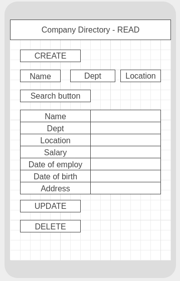
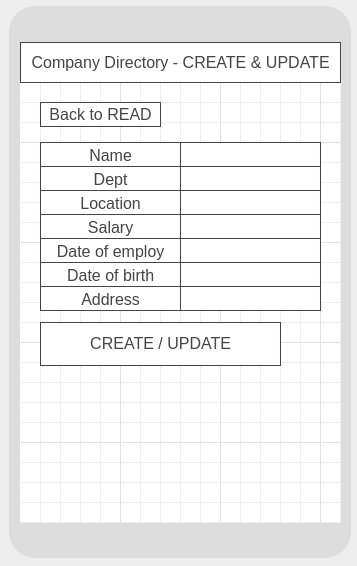
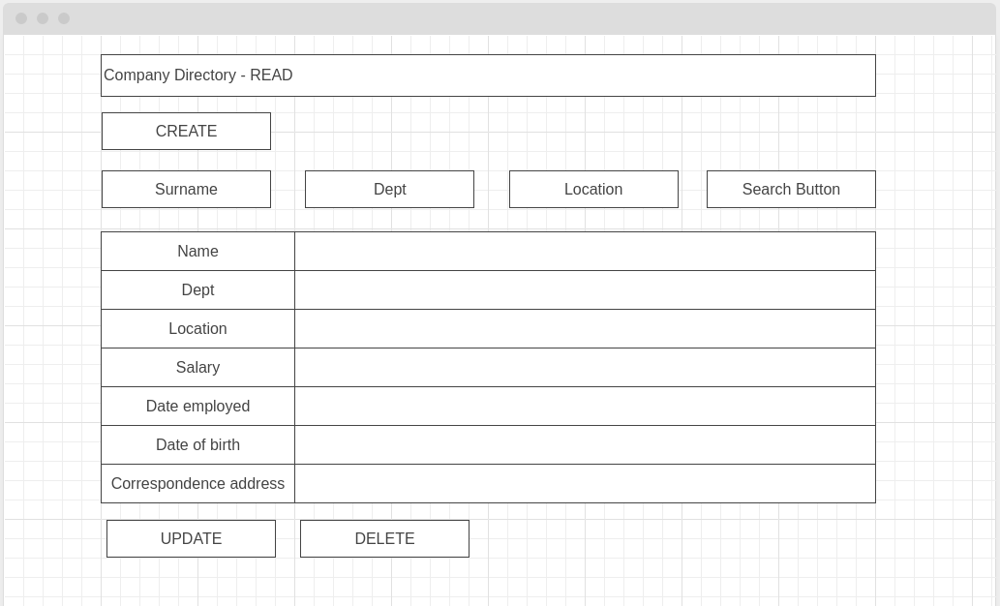
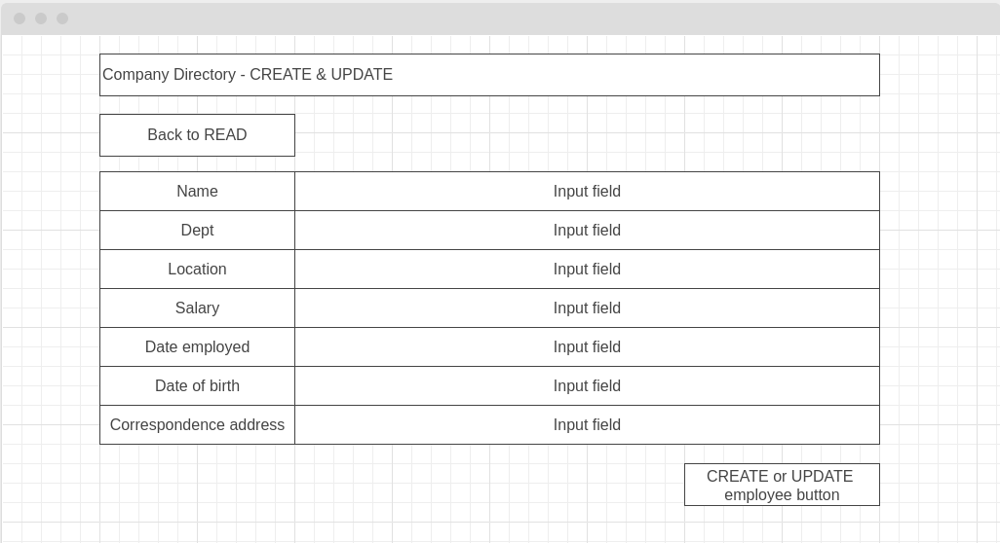

# Company Directory

### Joel Peyton
### Saturday 8th August 2020

### **1. Introduction**

This document sets out the functionality for the Portfolio Specification - Company Directory submitted by Paddy Evans from IT Career Switch. It includes a description of the product and its features, and details the programming languages and frameworks to be used. Also included are wireframe screenshots to provide a visual representation of how the application will look on both mobile / tablet and laptop / desktop devices.

### **2. Product Description**

#### **2.1 Scope**

A mobile and desktop application that allows users to query a company directory and retrieve employee data based on any or all of the following criteria: name, department, location. Additional features include employee creation, employee update, employee deletion.

- **CREATE**
- Link will open form allowing user to input employee data
- Submission of form will insert new employee into database using PHP / SQL

- **READ**
- Users will input search terms into supplied input fields and submit their query via a search button.
- This will initiate a search of the supplied database using PHP / SQL
- Returned results will be JSON encoded
- DOM manipulation will display results

- **UPDATE**
- Link will open form allowing user to update employee data
- Submission of form will update employee in the database using PHP / SQL

- **DELETE**
- Button will alert user that this will permanently delete employee
- Submission will remove employee from database using PHP / SQL

#### **2.2 Languages and Frameworks**

The application will be developed using the following:

- HTML / CSS with Bootstrap
- Javascript
- JQuery
- AJAX
- PHP with JSON encoding
- MariaDB / SQL

### **3. Product Layout**

#### **3.1 Mobile / Tablet**

#### **3.2 Laptop / Desktop**

